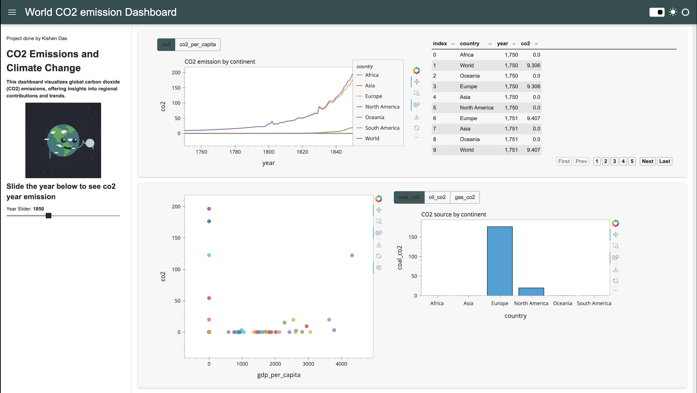

# Worldwide Carbon Dioxide Emissions (CO2) 🌎

Using co2 emissions data, cleaning and organising data on Jupyter Notebook. Then, creating a dashboard on Plotly, Panel and Hyplot. 

## Image of Dashboard:

